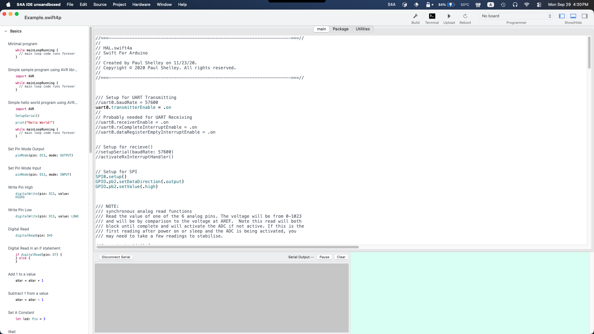
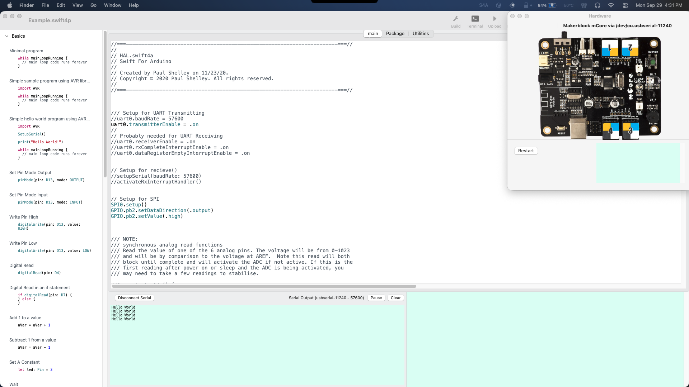
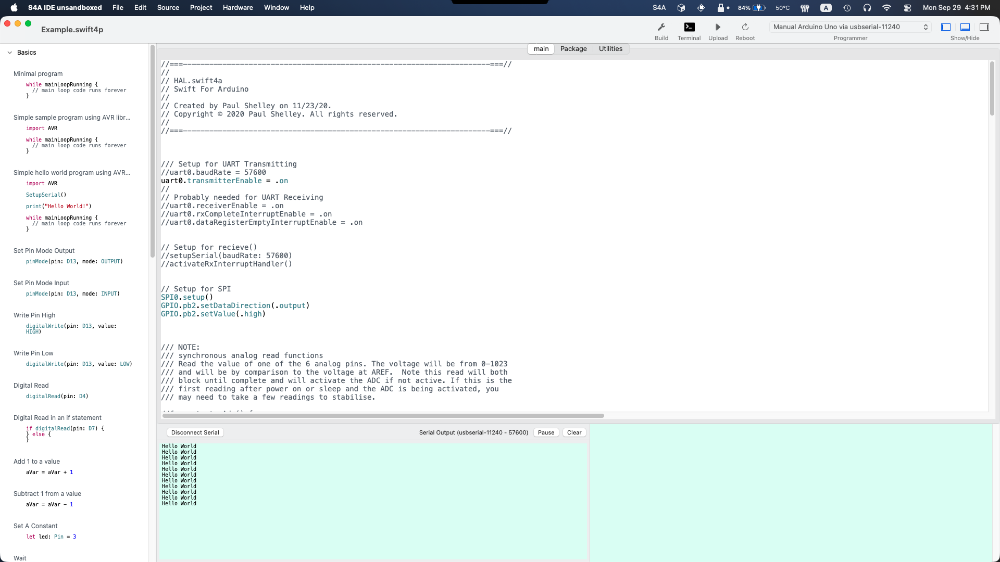
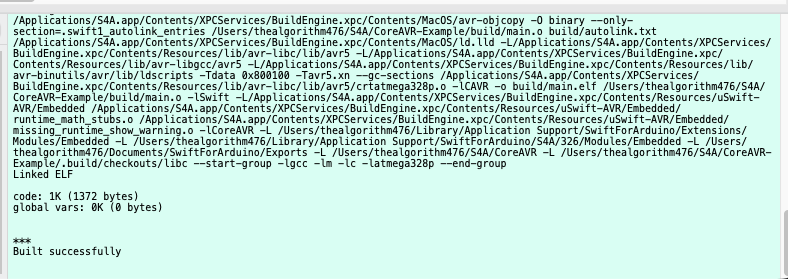
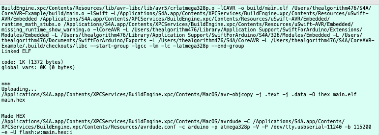
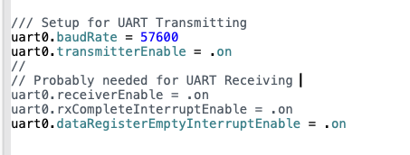
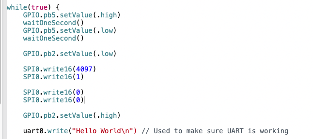

# CoreAVR-Example

## Quick-Start Guide (Building and Running)
### Setting things up
1. Begin by cloning the repository through a Terminal or Git Client of choice.
For Example: `git clone https://github.com/pdshelley/CoreAVR-Example.git`

2. Clone the CoreAVR repository in the same parent directory as CoreAVR-Example
For example, `/projects/CoreAVR` and `/projects/CoreAVR-Example` will work, `/projects/CoreAVR` and `/workspace/CoreAVR-Example` won't.
`git clone https://github.com/pdshelley/CoreAVR.git`

3. Open the `Example.swift4p` file using the S4A IDE. It will automatically set up the project.

4. Connect your Arduino to your Mac, and ensure S4A has picked it up as the right type of chip (you might need to change the type in the top-right corner of the IDE.)

### Running it
1. Click the "Build" button in the IDE. In the bottom right corner, you will see the output of the build process. This process should complete without any issues. CoreAVR will also be built automatically.

2. Click the "Upload" button in the IDE. The freshly compiled program should now be flashed to the Arduino. You might notice not a lot is happening: There's no Serial output, no flashing lights, and the chip generally isn't showing any signs of life. This is normal.

### Actually Running it
In the `main.swift`, you will need to uncomment the things you want to test. For example, to show "Hello, World!" on the Serial console, you will need to enable these parts of the code.
- Near the top of the file, there's a commented sectioon "Setup for UART Transmitting" and "Probably needed for UART Receiving". Uncomment both. UART will now be activated on startup.

- A bit further down, in the application's `while true` loop, there is a commented section "uart0.write ...". Uncommenting that will log "Hello, World!" to the Serial console.

All that's left is rebuilding the program, and reflashing it. You should now see "Hello, World!" being printed every second or so.
